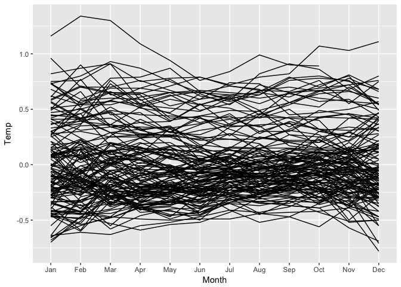

Earth Temperature
================

``` r
library(tidyverse)
```

    ## Loading tidyverse: ggplot2
    ## Loading tidyverse: tibble
    ## Loading tidyverse: tidyr
    ## Loading tidyverse: readr
    ## Loading tidyverse: purrr
    ## Loading tidyverse: dplyr

    ## Conflicts with tidy packages ----------------------------------------------

    ## filter(): dplyr, stats
    ## lag():    dplyr, stats

``` r
library(ggvis)
```

    ## 
    ## Attaching package: 'ggvis'

    ## The following object is masked from 'package:ggplot2':
    ## 
    ##     resolution

``` r
# From https://github.com/tidyverse/forcats
month_levels <- c(
  "Jan", "Feb", "Mar", "Apr", "May", "Jun", 
  "Jul", "Aug", "Sep", "Oct", "Nov", "Dec"
)

D_raw = read_table("mixedGLB.Ts.ERSSTV4.GHCN.CL.PA.txt", skip=7)
problems(D_raw)
```

    ## # A tibble: 0 × 4
    ## # ... with 4 variables: row <int>, col <int>, expected <chr>, actual <chr>

``` r
D_raw %>% 
  gather(2:13, key="Month", value="Temp") %>% 
  select(Year, Month, Temp) %>% 
  mutate(Month=parse_factor(Month, month_levels)) %>%
  mutate(Temp=parse_number(Temp)) %>%
  arrange(Year, Month) -> 
  D
```

    ## Warning: 2 parsing failures.
    ##  row col expected actual
    ## 1507  -- a number       
    ## 1644  -- a number

``` r
D
```

    ## # A tibble: 1,644 × 3
    ##     Year  Month  Temp
    ##    <int> <fctr> <dbl>
    ## 1   1880    Jan -0.30
    ## 2   1880    Feb -0.21
    ## 3   1880    Mar -0.18
    ## 4   1880    Apr -0.27
    ## 5   1880    May -0.14
    ## 6   1880    Jun -0.28
    ## 7   1880    Jul -0.23
    ## 8   1880    Aug -0.07
    ## 9   1880    Sep -0.17
    ## 10  1880    Oct -0.16
    ## # ... with 1,634 more rows

``` r
ggplot(data=D, mapping = aes(x=Month, y=Temp, group=Year)) + geom_line()
```

    ## Warning: Removed 2 rows containing missing values (geom_path).


